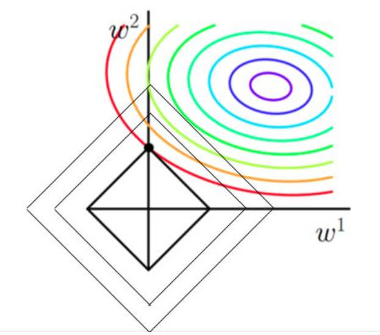
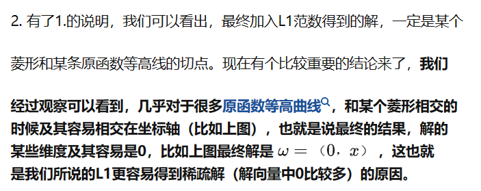
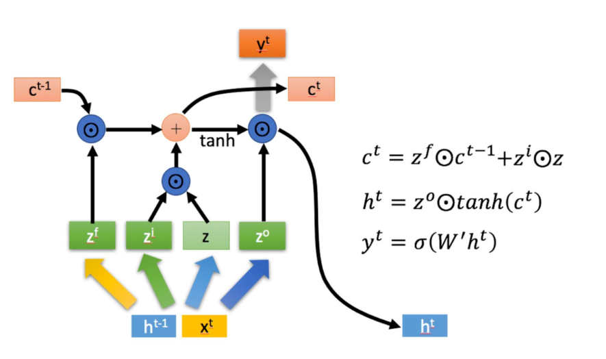
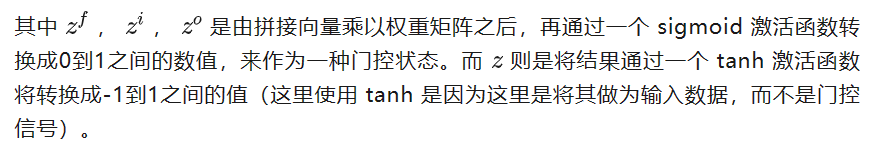
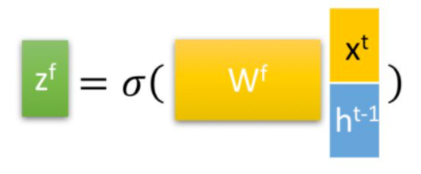
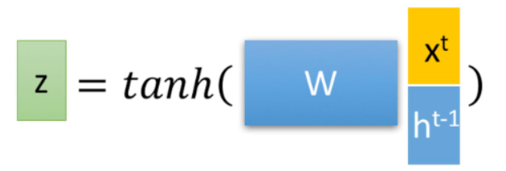

## 算法基础

### 卷积与全连接

卷积：局部链接、权值共享、保持空间结构

### 卷积网络各层感受野大小

感受野递推式：
$$
R_e^{(i)}=\min \left(R_e^{(i-1)}+\left(kernalsize^{(i)}-1\right) \prod_{j=0}^{i-1} stride^{(j)}, \quad L_e\right)
$$
Le是原始图像的尺寸

### 卷积变种

#### 分组卷积

将输入和输出通道划分为相同的组，卷积运算仅在对应的组中进行

分组卷积优点：如果分g组，则在输入输出通道数不变的情况下，参数量缩小为原先的1/g

当g=cin=cout时，为特殊情况深度可分离卷积，输入和输出的每一个通道一一对应，因此后面常常跟进1*1卷积融合通道之间的信息

#### 转置卷积

亦称反卷积，可以逆转普通卷积的维度变化，但并不能保证值可逆

一个卷积核尺寸为kw*kh 、滑动步长为(sw,sh)、边界填充尺寸为(pw,ph)的普通卷积，其所对应的转置卷积为：

对输入特征图的相邻像素之间填充(sw-1,sh-1)个0

输入特征图左右padding kw-pw-1个0，上下kh-ph-1

然后卷积核尺寸为kw*kh，滑动步长1进行卷积

**用途**：对特征图进行扩张或上采样

最右侧为反卷积对应的卷积实现操作步骤

#### 空洞卷积

一般采用池化操作（pooling）来扩大特征图的感受野，但这同时会降低特征图的分辨率，丢失一些信息（如内部数据结构、空间层级信息等），导致后续的上采样操作（如转置卷积）无法还原一些细节

因此引入空洞卷积，不通过池化等下采样操作扩大感受野，而是在标准的卷积核中注入“空洞”，以增加卷积核的感受野。

黄色部分是方块中心元素可以感受到的范围，颜色越深表示感受的次数/程度越多

#### 可变形卷积

卷积核不再是规则形状的，引入一组可学习的偏置参数决定卷积核的形状

可形变卷积的感受野不再是规则的方形区域

### 梯度消失与梯度爆炸

#### 梯度消失

由于sigmoid函数的导数不超过0.25，因此网络变深后梯度消失，浅层难以训练

**解决方案**：Relu，导数为1

#### 梯度爆炸

权重初始化过大

### ResNet

网络退化问题：随着网络深度增加，网络的表现先是逐渐增加至饱和，然后迅速下降。

网络退化不是过拟合导致的，过拟合的表现是训练集误差小，而测试集误差大，而网络退化不论训练集还是测试集，效果都不如浅层网络好

按照常理来说，深层网络不应该表现得更差，那么可以构造一个更深的网络，其最后几层仅是网络f第k层输出的恒等映射，就可以取得与f一致的结果，一个合理的猜测就是，恒等映射并不是那么好学的。

极端情况下，将残差映射推向0映射，仅保留近道的效果

### 瓶颈层

Bottleneck layer

瓶颈结构指的是通道数的变化，即原通道数先减少，后增大到原来的大小

瓶颈结构的初衷是为了降低大卷积层的计算量，即在计算比较大的卷积层之前，先用一个1×1卷积来压缩大卷积层输入特征图的通道数目，以减小计算量；在大卷积层完成计算之后，根据实际需要，有时候会再次使用一个1×1卷积来将大卷积层输出特征图的通道数目复原。

#### resnet中的瓶颈结构

#### 沙漏结构

沙漏结构的作用一般是将多尺度信息进行融合；同时，沙漏结构单元中堆叠的多个卷积层可以提升感受野，增强模型对小尺寸但又依赖上下文的物体（如人体关节点）的感知能力。

### 交叉验证

为了解决简单交叉验证的不足，提出k-fold交叉验证：

1、首先，将全部样本划分成k个大小相等的样本子集；2、依次遍历这k个子集，每次把当前子集作为验证集，其余所有样本作为训练集，进行模型的训练和评估；3、最后把k次评估指标的平均值作为最终的评估指标。在实际实验中，k通常取10.

### Batch Normalization

[【神经网络】网络中BN层的作用 - 知乎 (zhihu.com)](https://zhuanlan.zhihu.com/p/513326484)

[Batch Norm详解之原理及为什么神经网络需要它 - 知乎 (zhihu.com)](https://zhuanlan.zhihu.com/p/441573901)

BN层的结构

可训练参数$\beta$,$\gamma$,如果没有$\beta$,$\gamma$, 批归一化退化为普通的标准化，训练过程中，网络各层的参数虽然在更新，但是它们的输出分布却几乎不变（始终是均值为0、标准差为1），不能有效地进行学习。保证激活单元的非线性表达能力、使批归一化模块具有自我关闭能力。

各参数的向量形状如下图所示：

计算过程：

在训练过程中会以增量更新的方式记录均值和方差，在推理阶段，由于一次只有一个样本，没有批的概念，故会将让些在训练过程中存储下来的参数参与计算

BN层通常放在前一层的激活之后

作用有几点：

1、各特征的分布差异过大，导致网络难以训练，BN层分通道进行正则化（图像的特征就是通道？），就相当于对各特征进行正则化

2、

BN层的作用主要有三个：
(1). 加快网络的训练和收敛的速度
(2). 控制梯度爆炸防止梯度消失
(3). 防止过拟合

### Layer Normalization

**internal covarivate shift（内部协变量漂移）**问题，这个问题定义是随着batch normalizaiton这篇论文提出的，在训练过程中，数据分布会发生变化，对下一层网络的学习带来困难。
深度神经网络模型的训练为什么会很困难？其中一个重要的原因是，深度神经网络涉及到很多层的叠加，而每一层的参数更新会导致上层的输入数据分布发生变化，通过层层叠加，高层的输入分布变化会非常剧烈，这就使得高层需要不断去重新适应底层的参数更新。为了训好模型，我们需要非常谨慎地去设定学习率、初始化权重、以及尽可能细致的参数更新策略。

**BN**是取不同样本的同一个通道的特征做归一化；**LN**是取的是同一个样本的不同通道做归一化。

除了充分利用底层学习的能力，另一方面的重要意义在于保证获得非线性的表达能力。Sigmoid 等激活函数在神经网络中有着重要作用，通过区分**饱和区**和**非饱和区**，使得神经网络的数据变换具有了非线性计算能力。而第一步的规范化会将几乎所有数据映射到激活函数的非饱和区（线性区），仅利用到了线性变化能力，从而降低了神经网络的表达能力。而进行再变换，则可以将数据从线性区变换到非线性区，恢复模型的表达能力。

不要在CNN上使用LN？

### 激活函数

#### sigmoid

$$
\operatorname{sigmoid}(x)=\sigma=\frac{1}{1+e^{-x}}
$$

### 神经网络权重初始化

### BatchSize与学习率

### 全局平均池化

对于输出的每一个通道的特征图的所有像素计算一个平均值，经过全局平均池化之后就得到一个 维度=$C_{in}$=类别数 的特征向量，然后直接输入到softmax层

**作用：**代替全连接层，可接受任意尺寸的图像

**优点**：可以更好的将类别与最后一个卷积层的特征图对应起来、降低参数量，全局平均池化层没有参数，可防止在该层过拟合

### 正则化

#### L1正则化

$$
\mathrm{J}=\mathrm{J}_0+\alpha \sum_{\mathrm{w}}|\mathrm{w}|
$$

在原始损失函数后面加上网络权值的**绝对值之和**

作用：筛选特征

##### 几何解释

w1+w2=L的图像是一圈一圈的菱形，而原本损失函数的等势线是一圈一圈的

当等势线确定时，尽量让菱形与其只有一个相交点，这时总损失是最小的

##### 代数解释

[(52条消息) L1正则为什么更容易获得稀疏解_l1稀疏解_keep_forward的博客-CSDN博客](https://blog.csdn.net/b876144622/article/details/81276818)

L1正则化总体损失函数在0处是一个极值点

#### L2正则化

$$
\mathrm{J}=\mathrm{J}_0+\alpha \sum_{\mathrm{w}} \mathrm{w}^2
$$

在原本的损失函数的基础上增加了所有层所有参数的平方和

作用：防止过拟合

拟合过程中通常都倾向于让权值尽可能小，最后构造一个所有参数都比较小的模型。因为一般认为参数值小的模型比较简单，能适应不同的数据集，也在一定程度上避免了过拟合现象。可以设想一下对于一个线性回归方程，若参数很大，那么只要数据偏移一点点，就会对结果造成很大的影响；但如果参数足够小，数据偏移得多一点也不会对结果造成什么影响，专业一点的说法是抗扰动能力强。

### DropOut

在训练阶段，一般出现在FC中，随机丢弃一部分神经元

dropout可以视为一种模型集成，同时降低神经元之间的共适应关系，每个神经元不会对某个特定的其他神经元非常敏感，提升网络泛化能力

## 循环神经网络

$$
h_t=\sigma\left(U x_t+W h_{t-1}+b\right)
$$

xt为t时刻的输入，U是输出到隐层的权重，ht-1是上一时刻的隐状态，W是不同时刻隐层之间的连接权重，b为偏置
$$
o_t=g\left(V h_t+c\right)
$$
ot为t时刻的输出
$$
L=\sum_t L_t=\sum_t \operatorname{Loss}\left(o_t, y_t\right)
$$
训练时的loss由各时刻loss之和构成

### 反向传播

求导时需要注意
$$
\frac{\partial L}{\partial h_t}=\frac{\partial L}{\partial h_{t+1}} \frac{\partial h_{t+1}}{\partial h_t}+\frac{\partial L}{\partial o_t} \frac{\partial o_t}{\partial h_t}
$$
ht的求导来自于两个方面，其本身直接产生的loss以及其在后一个时间状态ht+1中产生的loss

### 长期依赖问题

理论上可以学习任意长度的序列信息，但根据前向传播和反向传播的公式可以看到其中存在矩阵的幂（权值共享造成，每次都会乘上一个相同的矩阵），由于梯度消失和梯度爆炸的缘故，难以学到时间距离较长的信息。

### LSTM

[人人都能看懂的LSTM (qq.com)](https://mp.weixin.qq.com/s?__biz=MzU0MDQ1NjAzNg==&mid=2247535325&idx=1&sn=7d805b06916a3da299e20c0445f59a07&chksm=fb3aefd6cc4d66c06b0f2d5779c83861474d2442f9b3387a4b87f45f3218efc92c3335602678&scene=27)

zf,zi,zo都是门控信号，用来决定信息的通过率

zf控制上一个单元的状态通过率

zi控制当前单元的新信息吸收率

zo控制当前单元的输出吐出率

门控信号的计算

很像attention的q,k,v

z本质上是把输入变换了一下，不同于门控信号，用tanh激活

### GRU

在LSTM的基础上进行简化，仅设置两个门，一个控制短期记忆，另一个控制长期记忆

两个门控信号，重置门rt，更新门zt
$$
\begin{aligned}
& r_t=\sigma\left(W_r x_t+U_r h_{t-1}\right) \\
& z_t=\sigma\left(W_z x_t+U_z h_{t-1}\right)
\end{aligned}
$$

$$
\begin{gathered}
\tilde{h}_t=\operatorname{Tanh}\left(W_h x_t+U_h\left(r_t \odot h_{t-1}\right)\right) \\
h_t=\left(1-z_t\right) h_{t-1}+z_t \tilde{h}_t
\end{gathered}
$$

ht~表示当前时刻吸收的信息，ht-1是上一个时刻传递过来的，用zt进行一个调和

### Seq2Seq

LSTM与GRU都是输入输出等长的，seq2seq可以解决输入输出不等长的序列处理任务

## GNN与GCN

$h_v^{(k)}$ : to indicate the representation of node *v* after the $k^{th}$ iteration

$x_v$ : the individual feature for node $v \in V$

### The Graph Laplacian

$L=D-A$

度矩阵-邻接矩阵

### Polynomials of the Laplacian

## GPT-4

## Zero-Shot

希望模型能够对没有见过的类型进行分类，使用一个文本特征对未见过的类进行提示

## 对比学习

对比学习要达到的目标是所有相似的物体在特征空间相邻的区域，而不相似的物体都在不相邻的区域

### 代理任务（pretext task）

通过构造一些监督信号方便自动生成的前置任务，模型在前置任务上训练后能够有效提升提取特征、理解图像的能力。然后在应用到目标任务时，去到原本代理任务的head，保留其具有图像理解能力的backbone，然后接上新的适配于当前任务的head。进行微调或其他操作。

个体判别、

### infoNCE loss

$$
l_{i, j}=-\log \frac{\exp \left(\operatorname{sim}\left(z_i, z_j\right) / \tau\right)}{\sum_{k=1}^{2 N} 1_{[k \neq i]} \exp \left(\operatorname{sim}\left(z_i, z_k\right) / \tau\right)}
$$

### InstDist

## 目标检测

### 框的概念

### RCNN系列

提出候选框 -> 对候选框内的图像提取特征 -> 分类 -> 预测框回归

